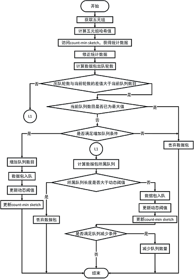

# 代码文档

本文档仅针对笔者在本科毕业论文**自适应公平队列算法的设计与实现**中编写的代码进行说明。代码未经过严格的测试，或许存在很多BUG，因此请读者不要太过相信这份文档。

<!-- TOC -->

- [代码文档](#代码文档)
    - [ns-3实现](#ns-3实现)
        - [AFQ](#afq)
            - [afq-queue-disc.h](#afq-queue-disch)
            - [afq-queue-disc.cc](#afq-queue-disccc)
        - [DQN-AFQ](#dqn-afq)
            - [dqn-queue-disc.h](#dqn-queue-disch)
            - [dqn-queue-disc.cc](#dqn-queue-disccc)
        - [测试代码](#测试代码)
            - [基本性能测试](#基本性能测试)
            - [公平性与收敛性](#公平性与收敛性)
            - [时延实验和参数讨论](#时延实验和参数讨论)
    - [p4实现](#p4实现)
        - [p4-AFQ](#p4-afq)
            - [afq.p4](#afqp4)
            - [commands.txt](#commandstxt)
            - [queueing.h](#queueingh)
        - [p4-DQN-AFQ](#p4-dqn-afq)

<!-- /TOC -->

## ns-3实现

这里描述的是如何使用ns-3实现AFQ与DQN-AFQ以及对实现的算法如何进行测试。

### AFQ

使用ns-3实现AFQ，需要编写两个文件，afq-queue-disc.h和afq-queue-disc.cc，前者为AfqQueueDisc类的声明，后者为具体方法的实现，下面将对这两个文件进行详细的介绍。

#### afq-queue-disc.h

```c++
class AfqQueueDisc : public QueueDisc
```

AfqQueueDisc为实现AFQ算法的类，QueueDisc为ns-3自带的用于定义队列调度策略的父类，在其中定义了许多有用的接口，事实上我们的工作就是继承该父类，实现其定义的接口，关于QueueDisc更多详细的内容，请参考[QueueDisc](https://www.nsnam.org/docs/release/3.29/doxygen/classns3_1_1_queue_disc.html)或到ns-3的官方文档中搜索QueueDisc。

```c++
static TypeId GetTypeId(void);
AfqQueueDisc();
virtual ~AfqQueueDisc();
static constexpr const char* LIMIT_EXCEEDED_DROP = "Queue disc limit exceeded";
static constexpr const char* QUEUE_EXCEEDED_DROP = "Queue number limit exceeded";
```

AfqQueueDisc类中的```GetTypeId```是一个与使用命令行对算法参数进行配置相关的接口，我们可以使用它对算法参数的初始值进行设置，同时也可以检查输入的参数是否符合算法需要，而最后两句字符串```LIMIT_EXCEEDED_DROP```和```QUEUE_EXCEEDED_DROP```，对应着两种丢包的情况，它们只作为log进行输出，并没有太多作用。

```c++
virtual bool DoEnqueue(Ptr<QueueDiscItem> item);
virtual Ptr<QueueDiscItem> DoDequeue (void);
virtual Ptr<const QueueDiscItem> DoPeek (void);
virtual bool CheckConfig (void);
virtual void InitializeParams (void);
```

上面就是我们需要实现的接口函数，其中```DoEnqueue```负责数据包入队，对应AFQ中的入队模块，而```DoDequeue```负责数据包出队，对应AFQ中的出队模块，```DoPeek```与```DoDequeue```逻辑类似，只不过前者并不真正出队，最后两个函数可进一步对算法中的参数进行核查与设置。

```c++
uint32_t count_min_sketch[4][16384];
uint32_t curr;
uint32_t DT;
uint8_t queue_number;
uint32_t BPR;
```

对于AFQ特有的参数，也需要在该文件中定义，可以看到在ns-3下，count-min sketch结构使用一个无符号整型的二维数组实现，```curr```为当前轮数，```DT```为队列长度阈值，```queue_number```为多队列结构的队列总数。

#### afq-queue-disc.cc

```GetTypeId```的具体实现如下：

```c++
TypeId AfqQueueDisc::GetTypeId(void)
{
    static TypeId tid = TypeId("ns3::AfqQueueDisc")
      .SetParent<QueueDisc>()
      .SetGroupName("TrafficControl")
      .AddConstructor<AfqQueueDisc>()
      .AddAttribute("MaxSize",
                    "The max queue size",
                    QueueSizeValue(QueueSize("1024p")),
                    MakeQueueSizeAccessor(&QueueDisc::SetMaxSize,
                                          &QueueDisc::GetMaxSize),
                    MakeQueueSizeChecker())
      .AddAttribute("QueueNumber",
                    "The number of Queues",
                    UintegerValue(64),
                    MakeUintegerAccessor(&AfqQueueDisc::queue_number),
                    MakeUintegerChecker<uint8_t>())
      .AddAttribute("DT",
                    "Dynamic threshold",
                    UintegerValue(1024),
                    MakeUintegerAccessor(&AfqQueueDisc::DT),
                    MakeUintegerChecker<uint32_t>())
      .AddAttribute("BPR",
                    "Byte per round",
                    UintegerValue(4096),
                    MakeUintegerAccessor(&AfqQueueDisc::BPR),
                    MakeUintegerChecker<uint32_t>());
    return tid;
}
```

其中```tid```可用于找到该类的对象，另外通过```AddAttribute```函数可以实现之前所说的用命令行对算法参数初始值进行设置，可以看到这里使用了类似```MakeQueue***Accessor```的函数对之前定义的变量进行了绑定，从命令行中输入的参数最终会储存在这些变量中。

函数```DoEnqueue```的实现如下：

```c++
bool AfqQueueDisc::DoEnqueue(Ptr<QueueDiscItem> item)
{
    NS_LOG_FUNCTION(this << item);

    uint32_t hash_values[4];
    for(uint8_t i = 0;i < 4;i++)
      {
          hash_values[i] = item -> Hash(i) % 16384;
      }

    uint32_t count_min = count_min_sketch[0][hash_values[0]];
    for(uint8_t i = 0;i < 4;i++)
      {
          if(count_min > count_min_sketch[i][hash_values[i]])
            {
                count_min = count_min_sketch[i][hash_values[i]];
            }
      }

    uint32_t bid = (count_min < BPR * curr) ? BPR * curr : count_min;
    bid =  bid + item -> GetSize();
    uint32_t pkt_round = bid / BPR;
    if(pkt_round - curr >= queue_number)
      {
          NS_LOG_LOGIC("lack of queues -- dropping pkt");
          DropBeforeEnqueue (item, QUEUE_EXCEEDED_DROP);
          return false;
      }

    if(GetInternalQueue(pkt_round % queue_number)->GetNPackets() + 1 > DT)
      {
          NS_LOG_LOGIC ("Queue full -- dropping pkt");
          DropBeforeEnqueue (item, LIMIT_EXCEEDED_DROP);
          return false;
      }

    bool retval = GetInternalQueue(pkt_round % queue_number)->Enqueue(item);

    if(retval)
      {
          for(uint8_t i = 0;i < 4;i++)
            {
                if(bid > count_min_sketch[i][hash_values[i]])
                  {
                      count_min_sketch[i][hash_values[i]] = bid;
                  }
            }
            DT = DT - 1;
      }
    NS_LOG_LOGIC ("Number packets " << GetInternalQueue (pkt_round % queue_number)->GetNPackets ());
    NS_LOG_LOGIC ("Number bytes " << GetInternalQueue (pkt_round % queue_number)->GetNBytes ());

    return retval;
}
```

函数的参数```item```即为将要入队的数据包，```NS_LOG_FUNCTION```和```NS_LOG_LOGIC```为ns-3自带的log子系统，用户可以根据需要自行开启或关闭，更多关于该系统的信息，请参考[logging](https://www.nsnam.org/docs/release/3.29/tutorial/html/tweaking.html#using-the-logging-module)。数组```hash_values```用于存放```Hash```函数返回的由IP源地址、IP目的地址、源端口、目的端口以及协议类型组成的五元组计算出来的哈希值，它们将作为索引用于访问在afq-queue-disc.h中定义的```count_min_sketch```。当需要对多队列结构中指定队列进行操作时，先使用```GetInternalQueue```获得队列的指针，然后再进行下一步操作，如数据包入队```GetInternalQueue(pkt_round % queue_number)->Enqueue(item);```。通过使用```DropBeforeEnqueue```可以将数据包进行丢包操作。以上代码的逻辑基本与AFQ算法的设计相符，通过阅读提出AFQ的论文**Approximating Fair Queueing on Reconfigurable Switches**，将对该部分代码有进一步的了解。最后值得注意的是，由于ns-3只使用单一线程进行网络仿真，因此论文中提到的共享数据同步问题在这里并不存在，代码中只存在一个变量```curr```保存当前轮数。

函数```DoDequeue```的实现如下：

```c++
Ptr<QueueDiscItem>
AfqQueueDisc::DoDequeue(void)
{
    NS_LOG_FUNCTION(this);

    Ptr<QueueDiscItem> item;
    for(uint8_t i = 0;i < queue_number;i++)
      {
          if((item = GetInternalQueue(curr % queue_number)->Dequeue()) != 0)
            {
                DT = DT + 1;
                return item;
            }
          curr = curr + 1;
      }

    NS_LOG_LOGIC("Queues empty");
    return item;
}
```

可以看到代码对每一个队列判读是否为空，为空则令当前轮数```curr```加1，否则返回取回的数据包。函数```DoPeek```的实现与之类似，最大的不同是```DoPeek```并不会将数据包出队。

函数```CheckConfig```的实现如下：

```c++
bool
AfqQueueDisc::CheckConfig(void)
{
    NS_LOG_FUNCTION(this);
    if(GetNQueueDiscClasses() > 0)
      {
          NS_LOG_ERROR("AfqQueueDisc cannot have classes");
          return false;
      }

    if(GetNPacketFilters() > 0)
      {
          NS_LOG_ERROR("AfqQueueDisc cannot have filter");
          return false;
      }

    if(GetNInternalQueues() == 0)
      {
          // add 8 DropTail queue
          for(uint8_t i = 0;i < queue_number;i++)
            {
                AddInternalQueue (CreateObjectWithAttributes<DropTailQueue<QueueDiscItem> >
                          ("MaxSize", QueueSizeValue (GetMaxSize ())));
            }
      }

    if(GetNInternalQueues() != queue_number)
      {
          NS_LOG_ERROR("AfqQueueDisc at least have queue_number internal queues");
      }

    return true;
}
```

其中重要的部分为判断多队列结构的队列数量是否与预期相符，如果```GetNInternalQueues() == 0```为真，那么多队列结构中就还未有队列，通过```AddInternalQueue```函数，可以增加队列数量，完成多队列结构的配置，这里需要注意的是，虽然在添加队列时设置了```MaxSize```参数，但是队列的长度受到阈值```DT```的控制，在这里阈值```DT```的初始值和```MaxSize```保持一致，这样做保证了控制队列长度的变量是```DT```而不是```MaxSize```。

### DQN-AFQ

DQN-AFQ的实现方法与AFQ类似，同样需要编写dqn-queue-disc.h和dqn-queue-disc.cc文件，下面将针对DQN-AFQ与AFQ不同的地方进行说明。

#### dqn-queue-disc.h

```c++
uint32_t count_min_sketch[4][16384];
uint32_t curr;
uint32_t DT;
uint8_t queue_number;
uint8_t n;
uint8_t n_star;
uint32_t delta;
uint32_t BPR;
double tu_low;
```

主要的不同在于多出了一些变量，```n```为记录当前启用队列数目的变量，```n_star```为记录将要启用队列数目的变量，```delta```为队列长度的上阈值，```tu_low```为缓存利用率的下阈值。

#### dqn-queue-disc.cc

```GetTypeId```的具体实现如下：

```c++
TypeId DqnQueueDisc::GetTypeId(void){
        static TypeId tid = TypeId("ns3::DqnQueueDisc")
            .SetParent<QueueDisc>()
            .SetGroupName("TrafficControl")
            .AddConstructor<DqnQueueDisc>()
            .AddAttribute("MaxSize",
                          "The max queue size",
                          QueueSizeValue(QueueSize("1024p")),
                          MakeQueueSizeAccessor(&QueueDisc::SetMaxSize,
                                                &QueueDisc::GetMaxSize),
                          MakeQueueSizeChecker())
            .AddAttribute("QueueNumber",
                          "The max number of Queues",
                          UintegerValue(64),
                          MakeUintegerAccessor(&DqnQueueDisc::queue_number),
                          MakeUintegerChecker<uint8_t>())
            .AddAttribute("DT",
                          "Dynamic threshold",
                          UintegerValue(1024),
                          MakeUintegerAccessor(&DqnQueueDisc::DT),
                          MakeUintegerChecker<uint32_t>())
            .AddAttribute("BPR",
                          "Byte per round",
                          UintegerValue(4096),
                          MakeUintegerAccessor(&DqnQueueDisc::BPR),
                          MakeUintegerChecker<uint32_t>())
            .AddAttribute("TULow",
                          "low utilization",
                          DoubleValue(0.2),
                          MakeDoubleAccessor(&DqnQueueDisc::tu_low),
                          MakeDoubleChecker())
            .AddAttribute("Delta",
                          "delta value",
                          UintegerValue(50),
                          MakeUintegerAccessor(&DqnQueueDisc::delta),
                          MakeUintegerChecker<uint32_t>());
        return tid;
    }
```

可以看到主要的不同就是对更多的变量进行了绑定，使之能通过命令输入来设置初始值。

```DoEnqueue```的具体实现如下：

```c++
bool DqnQueueDisc::DoEnqueue(Ptr<QueueDiscItem> item){
        NS_LOG_FUNCTION(this << item);

        uint32_t hash_values[4];
        for(uint8_t i = 0;i < 4;i++){
            hash_values[i] = item -> Hash(i) % 16384;
        }

        uint32_t count_min = count_min_sketch[0][hash_values[0]];
        for(uint8_t i = 0;i < 4;i++){
            if(count_min > count_min_sketch[i][hash_values[i]]){
                count_min = count_min_sketch[i][hash_values[i]];
            }
        }

        uint32_t bid = (count_min < BPR * curr) ? BPR * curr : count_min;
        bid = bid + item -> GetSize();

        uint32_t pkt_round = bid / BPR;

        uint32_t q1_len;

        bool retval;

        if(pkt_round - curr >= n){
            if(n == queue_number){
                NS_LOG_LOGIC("lack of queues -- dropping pkt");
                DropBeforeEnqueue (item, QUEUE_EXCEEDED_DROP);
                return false;
            }else{
                if(n == n_star){
                    double cor = 0;
                    for(uint8_t i = 0;i < n;i++){
                        cor = cor + 1.0 / (2.0 * (i + 1));
                    }
                    double temp_tu = 1 - (DT / 1024.0);
                    double tu = temp_tu / cor;
                    if(tu < tu_low){
                        n++;
                        n_star++;
                        retval = GetInternalQueue(((curr % queue_number) + pkt_round - curr) % queue_number) -> Enqueue(item);
                        if(retval){
                            for(uint8_t i = 0;i < 4;i++){
                                if(bid > count_min_sketch[i][hash_values[i]]){
                                    count_min_sketch[i][hash_values[i]] = bid;
                                }
                            }
                            DT--;
                        }
                        return retval;
                    }else{
                        NS_LOG_LOGIC("lack of queues -- dropping pkt");
                        DropBeforeEnqueue (item, QUEUE_EXCEEDED_DROP);
                        return false;
                    }
                }else{
                    NS_LOG_LOGIC("lack of queues -- dropping pkt");
                    DropBeforeEnqueue (item, QUEUE_EXCEEDED_DROP);
                    return false;
                }
            }
        }else{
            if(GetInternalQueue(((curr % queue_number) + pkt_round - curr) % queue_number) -> GetNPackets() + 1 > DT){
                NS_LOG_LOGIC ("Queue full -- dropping pkt");
                DropBeforeEnqueue (item, LIMIT_EXCEEDED_DROP);
                retval = false;
            }else{
                retval = GetInternalQueue(((curr % queue_number) + pkt_round - curr) % queue_number) -> Enqueue(item);
                if(retval){
                    for(uint8_t i = 0;i < 4;i++){
                        if(bid > count_min_sketch[i][hash_values[i]]){
                            count_min_sketch[i][hash_values[i]] = bid;
                        }
                    }
                    DT--;
                }
            }

            if(n == n_star && n_star > 1){
                q1_len = GetInternalQueue(((curr % queue_number) + 1) % queue_number) -> GetNPackets();
                if(q1_len > DT - delta){
                    n_star--;
                }
            }
            return retval;
        }
    }
```

这些代码描述的是DQN-AFQ入队模块的功能，其中在计算缓存利用率```tu```时，引入了一个变量```cor```，它用于存储缓存利用率的修正系数，将直接计算获得的缓存利用率与之相除即可以得到修正过后的缓存利用率。代码逻辑在毕业论文中有详细的讲述，下图为代码的流程图。



```DoDequeue```的具体实现如下：

```c++
Ptr<QueueDiscItem>
    DqnQueueDisc::DoDequeue(void){

        NS_LOG_FUNCTION(this);

        Ptr<QueueDiscItem> item;
        for(uint8_t i = 0;i < queue_number;i++){
            if((item = GetInternalQueue(curr % queue_number) -> Dequeue()) != 0){
                DT++;
                return item;
            }
            curr++;
            n = n_star;
        }

        NS_LOG_LOGIC("Queues empty");
        return item;
    }
```

基本逻辑与AFQ实现没有区别，只不过每当有队列为空时，需要将代表将启用的队列数目的变量```n_star```赋值给当前启用的队列数目```n```。

### 测试代码

这一部分主要是对测试代码进行一定的说明，同时给出如何使用测试代码进行测试。

首先以下代码的使用平台为ns-3.29，所以请按照[ns-3 install](https://www.nsnam.org/docs/release/3.29/tutorial/html/getting-started.html)的指示正确安装好ns-3。

/ns-3.29/src/traffic-control/model和/ns-3.29/src/traffic-control/example为我们主要工作的目录，前者用于存放队列的调度策略，即AFQ、DQN-AFQ，后者为测试代码的所在。

将前文提及的afq-queue-disc.h、afq-queue-disc.cc、dqn-queue-disc.h和dqn-queue-disc.cc拷贝进model目录下，并将它们的路径添加到/ns-3.29/src/traffic-control/wscript文件的module.source和headers.source字段中，回到/ns-3.29目录运行./waf命令，对新添加的队列调度模型进行编译。

#### 基本性能测试

此实验的配置描述文件为afq-vs-dqn.cc，其中代码根据ns-3项目中自带的例子以及官方教程编写，例子主要参考了/ns-3.29/src/traffic-control/example目录下的其它文件以及定义一个星形网络的/ns-3.29/examples/tcp/star.cc，官方的教程在这里[ns-3 Tutorial](https://www.nsnam.org/docs/release/3.29/tutorial/html/index.html)。

```c++
TrafficControlHelper tchmy;
if(DqnEnable){
  tchmy.SetRootQueueDisc("ns3::DqnQueueDisc");
}else{
  tchmy.SetRootQueueDisc("ns3::AfqQueueDisc");
}
tchmy.Install(star.GetHub()->GetDevice(star.SpokeCount() - 1));
```

在afq-vs-dqn.cc中，使用以上代码选择是否使用DQN-AFQ，变量```DqnEnable```默认为false，需要在命令输入时置为true才能启用DQN-AFQ。

```c++
monitor->CheckForLostPackets();
Ptr<Ipv4FlowClassifier> classifier = DynamicCast<Ipv4FlowClassifier>(flowmon.GetClassifier());
FlowMonitor::FlowStatsContainer stats = monitor->GetFlowStats();
for(std::map<FlowId, FlowMonitor::FlowStats>::const_iterator i = stats.begin (); i != stats.end (); ++i){
  Ipv4FlowClassifier::FiveTuple t = classifier->FindFlow (i->first);
  if(t.sourceAddress == "10.1.11.2" || t.destinationAddress == "10.1.11.2"){
    std::cout << "Flow " << i->first  << " (" << t.sourceAddress << " -> " << t.destinationAddress << ") "<<t.protocol<<"\n";
    std::cout << "  Duration:   "<<i->second.timeLastRxPacket.GetSeconds() - i->second.timeFirstTxPacket.GetSeconds()<<" Seconds\n";
  }
}
```

以上代码则用于对流量信息进行统计，参考了例子/ns-3.29/examples/tcp/tcp-pacing.cc。

最后要使用afq-vs-dqn.cc进行测试，首先将该文件拷贝到/ns-3.29/src/traffic-control/example下，并添加以下代码到该example目录下的wscript中。

```python
obj = bld.create_ns3_program('afq-vs-dqn', ['point-to-point', 'internet', 'applications', 'flow-monitor', 'traffic-control','netanim','point-to-point-layout'])
obj.source = 'afq-vs-dqn.cc'
```

退回/ns-3.29目录运行以下类似命令。

```cmd
./waf --run "afq-vs-dqn --DqnEnable=1 --ns3::DqnQueueDisc::QueueNumber=8 --nSpokes=12"
```

其中--DqnEnable=1用于启用DQN-AFQ，--ns3::DqnQueueDisc::QueueNumber=8用于指定DQN-AFQ多队列结构的队列数目，--nSpokes=12用于指定星形拓扑有几个spoke节点，类似的命令行参数还有一些，可以通过仿照上面的例子进行调整，也可以通过下面的命令进行查看。

```cmd
./waf --run "afq-vs-dqn --help"
```

#### 公平性与收敛性

由于这个实验需要计算实时吞吐量，因此它的流量统计代码与之前发生了较大的变化，具体实现如下。

```c++
void throughput(Ptr<FlowMonitor> monitor,FlowMonitorHelper* flowmon){
    std::map<FlowId,uint64_t>::iterator rbit;
    static std::map<FlowId,uint64_t> myRxBytes;
    static std::map<FlowId,double> myTimeLastRxPacket;

    static std::map<FlowId,uint64_t> myTxBytes;
    static std::map<FlowId,double> myTimeLastTxPacket;

    monitor->CheckForLostPackets();
    Ptr<Ipv4FlowClassifier> classifier = DynamicCast<Ipv4FlowClassifier>(flowmon -> GetClassifier());
    FlowMonitor::FlowStatsContainer stats = monitor->GetFlowStats();
    for(std::map<FlowId, FlowMonitor::FlowStats>::const_iterator i = stats.begin (); i != stats.end (); ++i){
        if((rbit = myRxBytes.find(i->first)) == myRxBytes.end()){
            Ipv4FlowClassifier::FiveTuple t = classifier->FindFlow (i->first);
            std::cout << "Flow " << i->first  << " (" << t.sourceAddress << " -> " << t.destinationAddress << ")\n";
            std::cout << "  Tx Packets: " << i->second.txPackets << "\n";
            std::cout << "  Tx Bytes:   " << i->second.txBytes << "\n";
            std::cout << "  Rx Packets: " << i->second.rxPackets << "\n";
            std::cout << "  Rx Bytes:   " << i->second.rxBytes << "\n";
            std::cout << "  Duration:   "<<i->second.timeLastRxPacket.GetSeconds() - i->second.timeFirstTxPacket.GetSeconds()<<" Seconds\n";
            std::cout << "  TxOffered:  " << i->second.txBytes * 8.0 / (i->second.timeLastTxPacket.GetSeconds()- i->second.timeFirstTxPacket.GetSeconds()) / 1000 / 1000  << " Mbps\n";
            std::cout << "  Throughput: " << i->second.rxBytes * 8.0 / (i->second.timeLastRxPacket.GetSeconds()- i->second.timeFirstTxPacket.GetSeconds())/1000/1000  << " Mbps\n";

            myRxBytes[i->first] = i->second.rxBytes;
            myTimeLastRxPacket[i->first] = i->second.timeLastRxPacket.GetSeconds();

            myTxBytes[i->first] = i->second.txBytes;
            myTimeLastTxPacket[i->first] = i->second.timeLastTxPacket.GetSeconds();
        }else{
            Ipv4FlowClassifier::FiveTuple t = classifier->FindFlow (i->first);
            std::cout << "Flow " << i->first  << " (" << t.sourceAddress << " -> " << t.destinationAddress << ")\n";
            std::cout << "  Tx Packets: " << i->second.txPackets << "\n";
            std::cout << "  Tx Bytes:   " << i->second.txBytes << "\n";
            std::cout << "  Rx Packets: " << i->second.rxPackets << "\n";
            std::cout << "  Rx Bytes:   " << i->second.rxBytes << "\n";
            std::cout << "  Duration:   "<<i->second.timeLastRxPacket.GetSeconds() - i->second.timeFirstTxPacket.GetSeconds()<<" Seconds\n";
            std::cout << "  TxOffered:  " << (i->second.txBytes - myTxBytes[i->first]) * 8.0 / (i->second.timeLastTxPacket.GetSeconds()- myTimeLastTxPacket[i->first]) / 1000 / 1000  << " Mbps\n";
            std::cout << "  Throughput: " << (i->second.rxBytes - myRxBytes[i->first]) * 8.0 / (i->second.timeLastRxPacket.GetSeconds()- myTimeLastRxPacket[i->first]) / 1000 / 1000  << " Mbps\n";

            myRxBytes[i->first] = i->second.rxBytes;
            myTimeLastRxPacket[i->first] = i->second.timeLastRxPacket.GetSeconds();

            myTxBytes[i->first] = i->second.txBytes;
            myTimeLastTxPacket[i->first] = i->second.timeLastTxPacket.GetSeconds();
        }
    }
    Simulator::Schedule (Seconds (0.5), &throughput,monitor,flowmon);
}
```

其中```myRxBytes```为每条流上次统计时发送的总字节数，而```myTimeLastRxPacket```为每条流上次统计时最后发出数据包的时间，类似的```myTxBytes```和```myTimeLastTxPacket```分别为每条流上次统计时接收的总字节数以及每条流上次统计时最后接收数据包的时间，最后通过调用```Simulator::Schedule```函数，确定了每隔0.5s进行一次统计。

测试代码fairness-and-convergence.cc的使用方法与afq-vs-dqn.cc类似，可以参照之前的描述进行实验。

#### 时延实验和参数讨论

这两个实验的测试代码的使用方法与之前的描述大同小异，并且差异主要为命令行参数，因此不再这里赘述了。

## p4实现

这一节将说明如何使用p4实现AFQ与DQN-AFQ，同时也将给出使用p4代码进行实验的步骤。

要使用p4进行实验，请先按照[bmv2](https://github.com/p4lang/behavioral-model)以及[p4c](https://github.com/p4lang/p4c)的指示安装好软件交换机以及p4语言的编译器。

### p4-AFQ

使用p4实现AFQ需要编写afq.p4和commands.txt文件，前者为AFQ的逻辑代码，后者为流表命令，另外还需要对我们使用的软件交换机进行改造，因此需要对/behavioral-model/include/bm/bm_sim/queueing.h进行改造。

#### afq.p4

在afq.p4文件中主要的工作就是完成```ingress```字段，它对应着AFQ入队模块的部分逻辑，完整的逻辑需要与软件交换机配合实现。afq.p4使用的p4版本为p4-14，参考了p4官方的语言规范以及教程，这里是[官方规范](https://p4.org/p4-spec/p4-14/v1.0.5/tex/p4.pdf)，这里是[官方教程](https://github.com/p4lang/tutorials)。下面是afq.p4的```ingress```字段的具体内容。

```c++
//ingress control
control ingress{
    //make sure the ipv4 packet ttl > 0
    if(ipv4.ttl > 0){
        //forward the packet according to its dstip
        apply(ipv4_forward);
        //make sure switch know how to forward the packet
        if(valid(udp) and standard_metadata.egress_spec != 511){
            //calculate the hashs
            apply(cal_hash);

            //get the count_min from sketch
            apply(get_counts);
            apply(get_min1);
            if(counter_table_metadata.count_min > counter_table_metadata.count2){
                apply(get_min2);
            }
            if(counter_table_metadata.count_min > counter_table_metadata.count3){
                apply(get_min3);
            }
            if(counter_table_metadata.count_min > counter_table_metadata.count4){
                apply(get_min4);
            }
            apply(get_curr);
            apply(get_bid1);
            if(bid_metadata.bid < BPR * bid_metadata.curr){
                apply(get_bid2);
            }
            apply(update_bid);
            apply(get_pkt_round);
            if((bid_metadata.pkt_round - bid_metadata.curr) >= NQ){
                apply(drop_table);
            }else{
                apply(update_pri);
                if(bid_metadata.bid > counter_table_metadata.count1){
                    apply(update_count1);
                }
                if(bid_metadata.bid > counter_table_metadata.count2){
                    apply(update_count2);
                }
                if(bid_metadata.bid > counter_table_metadata.count3){
                    apply(update_count3);
                }
                if(bid_metadata.bid > counter_table_metadata.count4){
                    apply(update_count4);
                }
                apply(update_cm);
                // apply(add_debug);
            }
        }
    }
}
```

在写p4程序时，有几点需要注意，每一个action都需要有对应的table才能运行，table不能被多次apply，p4代码中的除法或取余操作，除数必须为2的幂次方。另外其中使用的count min sketch由4个寄存器组组成，代码如下。

```c++
//count min sketch datastruct
register r1{width : 32; instance_count : CM_ROW_ELEM_COUNT;}
register r2{width : 32; instance_count : CM_ROW_ELEM_COUNT;}
register r3{width : 32; instance_count : CM_ROW_ELEM_COUNT;}
register r4{width : 32; instance_count : CM_ROW_ELEM_COUNT;}
```

```width```规定了每一个储存单元的字长，而```instance_count```规定了存储单元的数目。

afq.p4中的```egress```字段则对应着AFQ出队模块的部分逻辑，完整的逻辑同样也需要与软件交换机配合，```egress```字段的代码如下。

```c++
control egress{
    if(valid(udp) and queueing_metadata.deq_qdepth == 0){
        apply(update_curr);
    }
    apply(send_frame);
}
```

#### commands.txt

这个文件里都是一些关于流表操作的命令，内容如下。

```shell
table_set_default ipv4_forward do_drop
table_set_default cal_hash do_cal_hash
table_set_default get_counts do_get_counts
table_set_default get_min1 do_get_min1
table_set_default get_min2 do_get_min2
table_set_default get_min3 do_get_min3
table_set_default get_min4 do_get_min4
table_set_default get_curr do_get_curr
table_set_default get_bid1 do_get_bid1
table_set_default get_bid2 do_get_bid2
table_set_default update_bid do_update_bid
table_set_default get_pkt_round do_get_pkt_round
table_set_default drop_table do_drop
table_set_default update_pri do_update_pri
table_set_default update_count1 do_update_count1
table_set_default update_count2 do_update_count2
table_set_default update_count3 do_update_count3
table_set_default update_count4 do_update_count4
table_set_default update_cm do_update_cm
table_set_default update_curr do_update_curr
table_set_default send_frame do_drop
table_set_default add_debug do_add_debug
table_set_default update_debug do_update_bebug
table_add send_frame rewrite_mac 1 => 00:aa:bb:00:00:00
table_add send_frame rewrite_mac 2 => 00:aa:bb:00:00:01
table_add ipv4_forward do_forward 10.0.1.10/32 => 00:04:00:00:00:01 2
table_add ipv4_forward do_forward 10.0.0.10/32 => 00:04:00:00:00:00 1
```

```table_set_default```为设置缺省流表项的命令，当流表没有匹配时，将默认执行该命令定义的操作，```table_add```为添加流表项的命令，主要功能为根据相应字段进行匹配，执行对应操作，在这里主要作为数据包的转发表使用。

#### queueing.h

该文件主要负责软件交换机的入队与出队策略，它和p4程序配合，组成完整的算法逻辑，其中主要需要修改的是```QueueingLogicPriRL```类的```push_front```和```pop_back```函数。具体代码如下。

```c++
//! If priority queue \p priority of logical queue \p queue_id is full, the
//! function will return `0` immediately. Otherwise, \p item will be copied to
//! the queue and the function will return `1`. If \p queue_id or \p priority
//! are incorrect, an exception of type std::out_of_range will be thrown (same
//! if the FMap object provided to the constructor does not behave correctly).
int push_front(size_t queue_id, size_t priority, const T &item) {
    size_t worker_id = map_to_worker(queue_id);
    auto &q_info = queues_info.at(queue_id);
    auto &w_info = workers_info.at(worker_id);
    auto &q_info_pri = q_info.at(priority);
    LockType lock(w_info.q_mutex);
    if (q_info_pri.size >= q_info_pri.capacity) return 0;
    q_info_pri.last_sent = get_next_tp(q_info_pri);
    w_info.queues[priority].emplace(item, queue_id, q_info_pri.last_sent);
    q_info_pri.size++;
    q_info.size++;
    w_info.size++;
    w_info.q_not_empty.notify_one();
    return 1;
}
```

```c++
//! Retrieves an element for the worker thread indentified by \p worker_id and
//! moves it to \p pItem. The id of the logical queue which contained this
//! element is copied to \p queue_id and the priority value of the served
//! queue is copied to \p priority.
//! Elements are retrieved according to the priority queue they are in
//! (highest priorities, i.e. lowest priority values, are served first). Once
//! a given priority queue reaches its maximum rate, the next queue is served.
//! If no elements are available (either the queues are empty or they have
//! exceeded their rate already), the function will block.
void pop_back(size_t worker_id,size_t *queue_id,size_t *priority,T *pItem){
    auto &w_info = workers_info.at(worker_id);
    LockType lock(w_info.q_mutex);
    MyQ *queue = nullptr;
    size_t index;
    size_t temp_start_priority;
    while(true){
      if(w_info.size == 0){
        w_info.q_not_empty.wait(lock);
      }else{
        auto now = clock::now();
        auto next = clock::now();
        temp_start_priority = w_info.start_priority;
        for(size_t pri = 0;pri < nb_priorities;pri++){
          index = (temp_start_priority + pri) % nb_priorities;
          auto &q = w_info.queues[index];
          if(q.size() == 0){
            w_info.start_priority = (index + 1) % nb_priorities;
            // w_info.deficits[index] = 100000;
            continue;
          }
          if(q.top().send <= now){
            queue = &q;
            break;
          }else{
            next = q.top().send;
            break;
          }
        }
        if(queue) break;
        w_info.q_rate_limit.wait_until(lock,next);
      }
    }
    *queue_id = queue -> top().queue_id;
    *priority = index;
    *pItem = std::move(const_cast<QE &>(queue -> top()).e);
    queue -> pop();
    auto &q_info = queues_info.at(*queue_id);
    auto &q_info_pri = q_info.at(*priority);
    q_info_pri.size--;
    q_info.size--;
    w_info.size--;
}
```

最后将给出如何使用以上文件进行测试。

将queueing.h文件拷贝到目录/behavioral-model/include/bm/bm_sim下，在/behavioral-model/targets/simple_switch目录下执行```make```命令，获得改造后的软件交换机。

使用p4c对afq.p4进行编译，命令如下。

```cmd
p4c --target bmv2 --arch v1model --std p4-14 afq.p4
```

执行完该命令后，将会获得afq.json文件。

进入目录/behavioral-model/mininet，执行以下命令。

```shell
sudo python 1sw_demo.py --behavioral-exe ../target/simple_switch/simple_switch --json /your path/afq.json
```

执行该命令后，将会得到一个mininet终端环境。

进入目录/behavioral-model/target/simple_switch，执行以下命令。

```shell
./runtime_CLI < /your path/commands.txt
```

至此一个以AFQ为数据包调度策略的软件交换机simple_switch，将运行在mininet环境下，用户可以根据[mininet使用方法](http://mininet.org/sample-workflow/)，自行设计实验进行测试。

### p4-DQN-AFQ

用p4实现DQN-AFQ的步骤基本与AFQ一致，需要编写的文件与修改的文件分别为dqn_afq.p4、commands.txt和queueing.h。

使用方法与AFQ实现时基本一样，在这里就不描述了。
